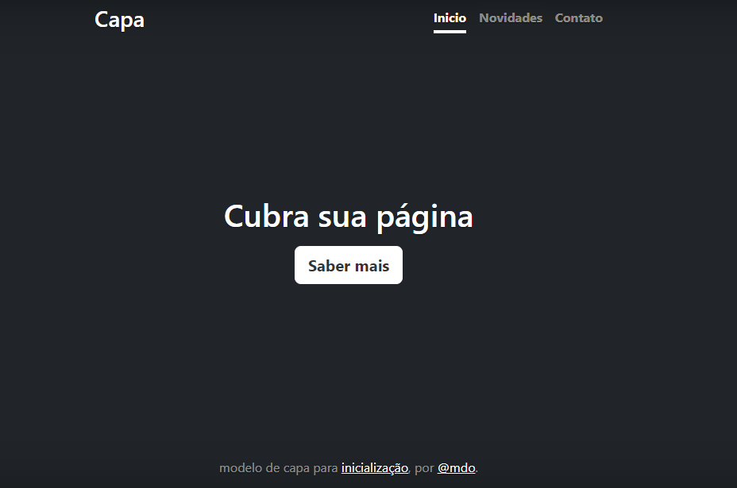
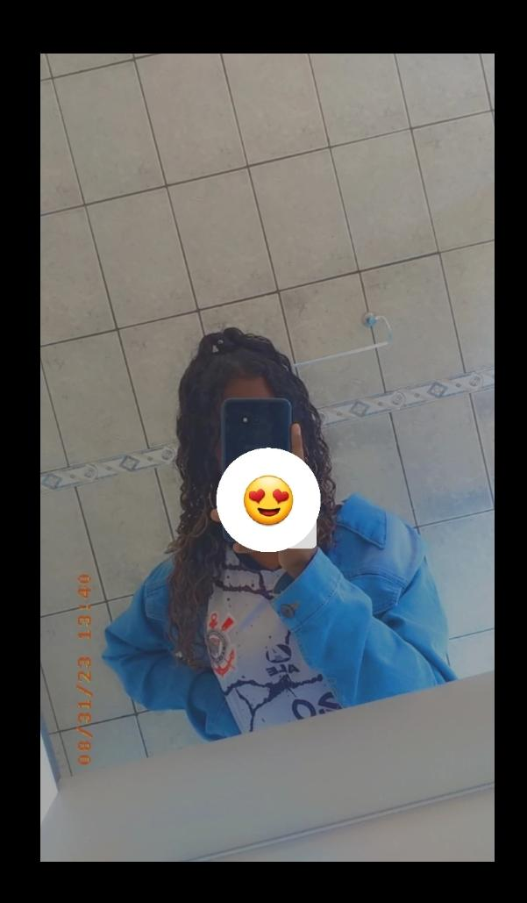

# indice 
[projeto - aprendendo a escrever o README](#projeto---aprendendo-a-escrever-o-readme)  
[Descrição](#descri%C3%A7%C3%A3o)  
[introdução](#introdu%C3%A7%C3%A3o)  
[funcionalidade](#funcionalidade)  
[tecnologia utilizada](#tecnologia-utilizada)  
[fontes consultadas](#fontes-consultadas)  
[autores](#autores)  

# projeto - aprendendo a escrever o README

## Descrição 
É um projeto de capa que tem o inicio que seria a tela principal, temos as novidades que fala um pouco sobre o aplicativo e suas funcionalidades e fala tambem sobre as proximas atualizações do app e tem o contato se acaso o usuario se interresar pelo conteudo ou estiver tento algum problema.
## introdução 

## funcionalidade 

### tecnologia utilizada
USAMOS   
HTML  
CSS  
IMG  
## fontes consultadas
https://gist.github.com/lohhans/f8da0b147550df3f96914d3797e9fb89  
https://www.alura.com.br/artigos/escrever-bom-readme   
## autores
Heloá   
