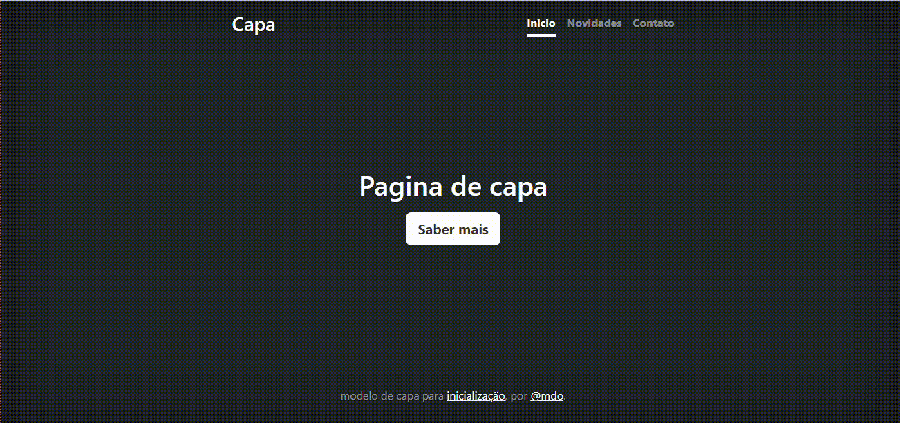

# indice 
[Projeto - aprendendo a escrever o README](#projeto---aprendendo-a-escrever-o-readme)  
[Descrição](#descri%C3%A7%C3%A3o)  
[introdução](#introdu%C3%A7%C3%A3o)  
[funcionalidade](#funcionalidade)  
[tecnologia utilizada](#tecnologia-utilizada)  
[fontes consultadas](#fontes-consultadas)  
[autores](#autores)  

# projeto - aprendendo a escrever o README

## Descrição 
É um projeto de capa que tem o inicio que seria a tela principal, temos as novidades que fala um pouco sobre o aplicativo e suas funcionalidades e fala tambem sobre as proximas atualizações do app e tem o contato se acaso o usuario se interresar pelo conteudo ou estiver tento algum problema.

## introdução 
A página inclui título, meta tags para especificar a codificação de caracteres, tamanho da janela de visualização e descrição da página, bem como links para o CSS da biblioteca Bootstrap e um arquivo CSS personalizado. Também há um cabeçalho com título, barra de navegação e um conteúdo principal com um título, texto e um botão, além de um rodapé com informações sobre o modelo de capa e seu criador.

## funcionalidade 
Esse é um código HTML para uma página web que possui um modelo de capa (cover) utilizando a biblioteca Bootstrap v5.0. Ele inclui o título da página, uma barra de navegação com links para a página inicial, novidades e contato, um conteúdo principal com um título e um botão "Saber mais" e um rodapé com informações sobre o modelo de capa e seu criador. O código também inclui alguns estilos personalizados para a página.

### tecnologia utilizada
USAMOS   
HTML  
CSS  
IMG  
## fontes consultadas
* [Lohhans](https://gist.github.com/lohhans/f8da0b147550df3f96914d3797e9fb89) - exemplo de README
* [Alura](https://www.alura.com.br/artigos/escrever-bom-readme) - C
## autores
Heloá   

